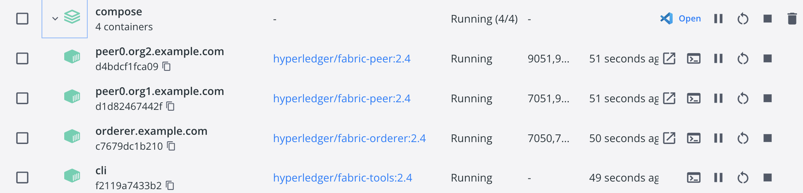
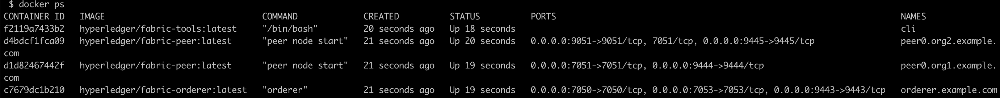
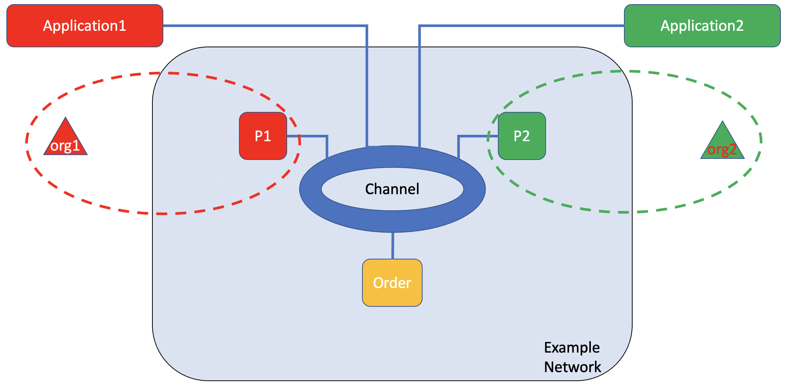
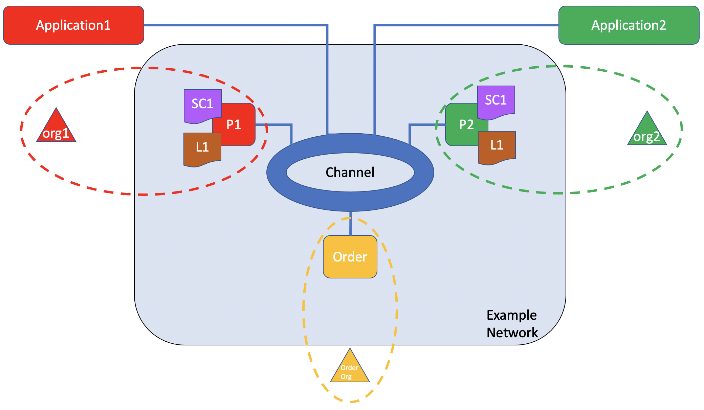

# Blockchain

We setup a hyperledgr fabric blockchain baseline environment which can be used for future projects built on it.

## 0. Prerequisites
- Advanced Operating Systems (Distributed Systems) - Graduate level 
  - Ordering, Gossip, BFT, Raft
- Computer Security
  - Hash
  - Cryptography
  - Public Key Infrastructure (PKI)
- Key Concepts in [Hyperledger-Fabric Offical website](https://hyperledger-fabric.readthedocs.io/en/latest/key_concepts.html)

  Note:
    It would be better if you have took the first two courses. If not please read "Key Concepts" and understand them.
- [Docker](docker.md)


  
## 1. Installation

0. Check prerequisites

https://hyperledger-fabric.readthedocs.io/en/latest/prereqs.html


1. Create a folder for Go. 

```
mkdir -p $HOME/go/src/github.com/<your_github_userid>

cd $HOME/go/src/github.com/<your_github_userid>
```
This is a Golang Community recommendation for Go projects.

2. To get the install script:

```
curl -sSLO https://raw.githubusercontent.com/hyperledger/fabric/main/scripts/install-fabric.sh && chmod +x install-fabric.sh
```

This will download ```install-fabric.sh``` into the directory ```$HOME/go/src/github.com/<your_github_userid>```.


3. Pull the Docker containers and clone the samples repo
```
./install-fabric.sh docker samples binary 

or 

./install-fabric.sh d s b  
```

This will  download a directory named ```fabric-samples```.

Now that you have downloaded Fabric and the samples, you can start running Fabric.

## 2. Using the Fabric test network: 

Reference: https://hyperledger-fabric.readthedocs.io/en/latest/test_network.html


### 2.1 Run the example (Fabric test network)

Then you can run  the example. 

*Don't modify this example. Once modify, it doesn't work. Later you create your own network.*

You can find the scripts to bring up the network in the test-network directory of the fabric-samples repository. Navigate to the test network directory by using the following command:

```c
Start your docker. // If you use "Docker Desktop" just click its icon. 

cd fabric-samples/test-network // continue use same directory as above

./network.sh down // to make sure everything is down

// It will print below or similar:
// Kill one or more running containers

// At this moment, check your containers in Docker Desktop, or check using "docker ps", you should see no related containers running.

./network.sh up // start up you network

// At this moment, check your containers in Docker Desktop, or check using "docker ps", you should see 4 containers running.
```

Screenshot for 4 containers running:





### 2.2 Create a channel

To create a channel between Org1 and Org2 and join their peers to the channel
```
./network.sh createChannel -c dayuanchannel
```
It will print "Channel 'dayuanchannel' created:





### 2.3 Starting a chaincode on the channel

After you have created a channel, you can start using smart contracts to interact with the channel ledger.

In Fabric, **smart contracts** are deployed on the network in packages referred to as **chaincode**. A Chaincode is **installed** on the peers of an organization and then deployed to a channel, where it can then be used to endorse transactions and interact with the blockchain ledger. Before a chaincode can be **deployed** to a channel, the members of the channel need to **agree on a chaincode definition** that establishes chaincode governance. When the required number of organizations agree, the chaincode definition can be committed to the channel, and the chaincode is ready to be used.

To start a chaincode on the channel using the following command:

```c
./network.sh deployCC -ccn basic -c dayuanchannel -ccp ../asset-transfer-basic/chaincode-go -ccl go


// -c <channel name> - Name of channel to deploy chaincode to
// -ccn <name> - Chaincode name.
// -ccl <language> - Programming language of the chaincode to deploy: go, java, javascript, typescript
// -ccp <path>  - File path to the chaincode.
// -ccep <policy>  - (Optional) Chaincode endorsement policy using signature policy syntax. The default policy requires an endorsement from Org1 and Org2
// -cccg <collection-config>  - (Optional) File path to private data collections configuration file
```

It will print below following steps we mentioned in above paragraph, and those printed log reflects the so called "[chaincode life cycle](https://hyperledger-fabric.readthedocs.io/en/latest/chaincode_lifecycle.html)":
```
Chaincode is packaged
Chaincode is installed on peer0.org1
Chaincode is installed on peer0.org2
Query installed successful on peer0.org1 on channel
Chaincode definition approved on peer0.org1 on channel 'dayuanchannel'
Chaincode definition approved on peer0.org2 on channel 'dayuanchannel'
Chaincode definition committed on channel 'dayuanchannel'
Query chaincode definition successful on peer0.org1 on channel 'dayuanchannel'
Query chaincode definition successful on peer0.org2 on channel 'dayuanchannel'
```



### 2.4 Interacting with the network

### 2.4.1 Set the environment variables

Use the following command to add those binaries to your CLI (Command line interface) Path:

```c
export PATH=${PWD}/../bin:$PATH // need to do this every time after clossing current CLI
```


You also need to set the FABRIC_CFG_PATH to point to the core.yaml file in the fabric-samples repository: 
```c 
export FABRIC_CFG_PATH=$PWD/../config/ // need to do this every time after clossing current CLI
```

Then set the environment variables that allow you to operate the peer CLI as Org1: Execute below commands one by one:

```
export CORE_PEER_TLS_ENABLED=true
```
```
export CORE_PEER_LOCALMSPID="Org1MSP"
```
```
export CORE_PEER_TLS_ROOTCERT_FILE=${PWD}/organizations/peerOrganizations/org1.example.com/peers/peer0.org1.example.com/tls/ca.crt
```
CORE_PEER_TLS_ROOTCERT_FILE and CORE_PEER_MSPCONFIGPATH environment variables point to the Org1 crypto material in the organizations folder.
```
export CORE_PEER_MSPCONFIGPATH=${PWD}/organizations/peerOrganizations/org1.example.com/users/Admin@org1.example.com/msp
```
```
export CORE_PEER_ADDRESS=localhost:7051
```

### 2.4.2 Initialize the ledger with assets

Then to initialize the ledger with assets. (Note the CLI does not access the Fabric Gateway peer, so each endorsing peer must be specified.)
```
peer chaincode invoke -o localhost:7050 --ordererTLSHostnameOverride orderer.example.com --tls --cafile "${PWD}/organizations/ordererOrganizations/example.com/orderers/orderer.example.com/msp/tlscacerts/tlsca.example.com-cert.pem" -C dayuanchannel -n basic --peerAddresses localhost:7051 --tlsRootCertFiles "${PWD}/organizations/peerOrganizations/org1.example.com/peers/peer0.org1.example.com/tls/ca.crt" --peerAddresses localhost:9051 --tlsRootCertFiles "${PWD}/organizations/peerOrganizations/org2.example.com/peers/peer0.org2.example.com/tls/ca.crt" -c '{"function":"InitLedger","Args":[]}'
```

If success it will print "INFO [chaincodeCmd] chaincodeInvokeOrQuery -> Chaincode invoke successful. result: status:200"

ou can now query the ledger from your CLI. Run the following command to get the list of assets that were added to your channel ledger:
```
peer chaincode query -C dayuanchannel -n basic -c '{"Args":["GetAllAssets"]}'
```

It prints:
```json
[
  {
    "AppraisedValue":300,
    "Color":"blue",
    "ID":"asset1",
    "Owner":"Tomoko",
    "Size":5
  },{
    "AppraisedValue":400,
    "Color":"red",
    "ID":"asset2",
    "Owner":"Brad",
    "Size":5
  },{
    "AppraisedValue":500,
    "Color":"green",
    "ID":"asset3",
    "Owner":"Jin Soo",
    "Size":10
  },{
    "AppraisedValue":600,
    "Color":"yellow",
    "ID":"asset4",
    "Owner":"Max",
    "Size":10
  },{
    "AppraisedValue":700,
    "Color":"black",
    "ID":"asset5",
    "Owner":"Adriana",
    "Size":15
  },{
    "AppraisedValue":800,
    "Color":"white",
    "ID":"asset6",
    "Owner":"Michel",
    "Size":15
  }
]
```


### 2.4.3 Change the owner of an asset on the ledger by invoking the asset-transfer (basic) chaincode

Chaincodes are invoked when a network member wants to transfer or change an asset on the ledger. Use the following command to change the owner of an asset on the ledger by invoking the asset-transfer (basic) chaincode:

We use below command to transfer "asset6" changing its owner from "Michel" to "Christopher":

```c
peer chaincode invoke -o localhost:7050 --ordererTLSHostnameOverride orderer.example.com --tls --cafile "${PWD}/organizations/ordererOrganizations/example.com/orderers/orderer.example.com/msp/tlscacerts/tlsca.example.com-cert.pem" -C dayuanchannel -n basic --peerAddresses localhost:7051 --tlsRootCertFiles "${PWD}/organizations/peerOrganizations/org1.example.com/peers/peer0.org1.example.com/tls/ca.crt" --peerAddresses localhost:9051 --tlsRootCertFiles "${PWD}/organizations/peerOrganizations/org2.example.com/peers/peer0.org2.example.com/tls/ca.crt" -c '{"function":"TransferAsset","Args":["asset6","Christopher"]}'
```


If the command is successful, you should see the following response:
```
INFO [chaincodeCmd] chaincodeInvokeOrQuery -> Chaincode invoke successful. result: status:200 payload:"Michel"
```

We can check the ledge again to see what has been changed:

```c
peer chaincode query -C dayuanchannel -n basic -c '{"Args":["GetAllAssets"]}' // same command we used before
```

It prints:
```json
[
  {
    "AppraisedValue":300,
    "Color":"blue",
    "ID":"asset1",
    "Owner":"Tomoko",
    "Size":5
  },{
    "AppraisedValue":400,
    "Color":"red",
    "ID":"asset2",
    "Owner":"Brad",
    "Size":5
  },{
    "AppraisedValue":500,
    "Color":"green",
    "ID":"asset3",
    "Owner":"Jin Soo",
    "Size":10
  },{
    "AppraisedValue":600,
    "Color":"yellow",
    "ID":"asset4",
    "Owner":"Max",
    "Size":10
  },{
    "AppraisedValue":700,
    "Color":"black",
    "ID":"asset5",
    "Owner":"Adriana",
    "Size":15
  },{
    "AppraisedValue":800,
    "Color":"white",
    "ID":"asset6",
    "Owner":"Christopher",// Only difference than before. It was "Michel" here.
    "Size":15
  }
]
```

### Check the change in ledge from Org2 peer

we can use another query to see how the invoke changed the assets on the blockchain ledger. Since we already queried the Org1 peer, we can take this opportunity to query the chaincode running on the Org2 peer. Set the following environment variables to operate as Org2:

#### Environment variables for Org2

```c
export CORE_PEER_TLS_ENABLED=true
export CORE_PEER_LOCALMSPID="Org2MSP"
export CORE_PEER_TLS_ROOTCERT_FILE=${PWD}/organizations/peerOrganizations/org2.example.com/peers/peer0.org2.example.com/tls/ca.crt
export CORE_PEER_MSPCONFIGPATH=${PWD}/organizations/peerOrganizations/org2.example.com/users/Admin@org2.example.com/msp
export CORE_PEER_ADDRESS=localhost:9051
```

You can now query the asset-transfer (basic) chaincode running on peer0.org2.example.com:
```
peer chaincode query -C dayuanchannel -n basic -c '{"Args":["ReadAsset","asset6"]}'
```
The result will show that "asset6" was transferred to Christopher:
```
{"AppraisedValue":800,"Color":"white","ID":"asset6","Owner":"Christopher","Size":15}
```