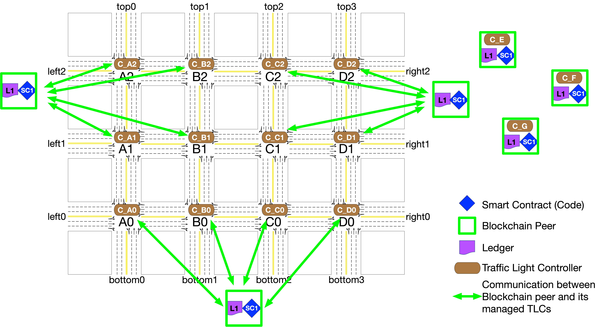
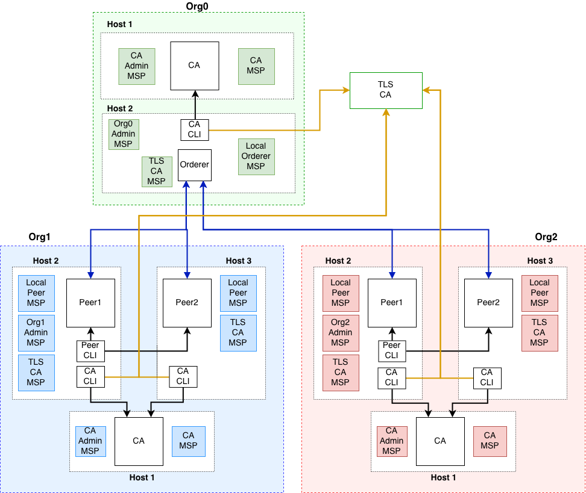

## 3. Deploy my production network

- [3. Deploy my production network](#3-deploy-my-production-network)
- [3. 1 Step one: Decide on your network configuration](#3-1-step-one-decide-on-your-network-configuration)
- [3.2 Step two: Set up a cluster for your resources](#32-step-two-set-up-a-cluster-for-your-resources)
- [3.3 Step three: Set up your CAs](#33-step-three-set-up-your-cas)
  - [3.3.1 Fabric CA](#331-fabric-ca)
- [3.4 Decide not to use production network](#34-decide-not-to-use-production-network)

## 3. 1 Step one: Decide on your network configuration

- Blockchain
  - 5 blockchain peers
    - 1 orderer
    - 4 peers which as hubs for 4 intersections
- 3 organizations
  - 1st has 2 peers
  - 2nd has 2 peers
  - 3rd has 1 orderer
- 16 nodes/intersections
 

(This figure needs to be modified to match above peer amount.)

- Certificate Authority configuration
  - 6 peers
    - one overall channel
  - ordering service 
    - one orderer, which is the 7th peer
  - TLS CA 
- Use Organizational Units or not?
  - Not yet
- Database type
  - Use defalut LevelDB (key-value database)
- Create a system channel or not
  - Use the recommended method: bootstrap ordering nodes without a configuration block ("system channel")
- Channels and private data
  - For us, channels are enough to ensure privacy and isolation for transactions
- Container orchestration
- Chaincode deployment method
  - options
    - Use a built-in build and run support
      - It looks this is the default. Use this firstly.
    - Use a customized build and run using the External builders and Launchers
    - Use an Running Chaincode as an External Service
- Using firewalls
  
## 3.2 Step two: Set up a cluster for your resources

- Persistent Storage
  - You will also need to add storage to your cluster (some cloud providers may provide storage) as you cannot configure Persistent Volumes and Persistent Volume Claims without storage being set up with your cloud provider first. The use of persistent storage ensures that data such as MSPs, ledgers, and installed chaincodes are not stored on the container filesystem, preventing them from being destroyed if the containers are destroyed.

## 3.3 Step three: Set up your CAs

- 1st compoenet must be a CA
  - Use default Fabric CA

### 3.3.1 Fabric CA

https://hyperledger-fabric-ca.readthedocs.io/en/latest/operations_guide.html

## 3.4 Decide not to use production network

***At this moment I decide to use the Fabric test network instead of creating our own production network. Too many steps to do for a production network.***