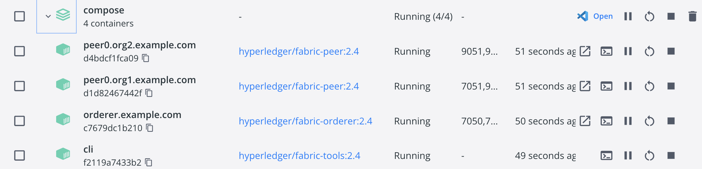
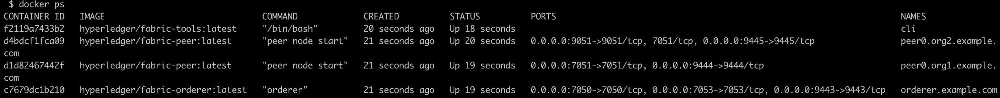
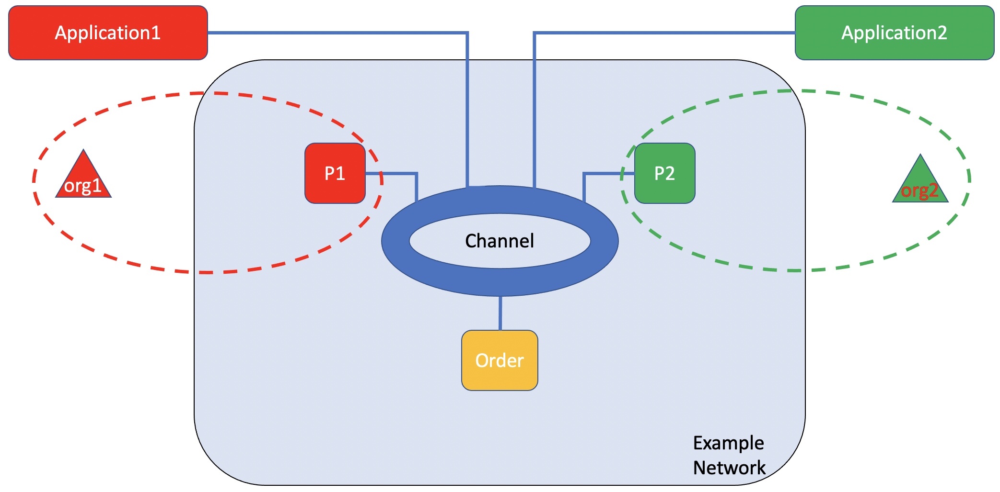

# Blockchain


|Notice:|
|-|
|This file is based on [example_network.md](./example_network.md). I modify it by adding nodes to total 7 nodes.|
|Official webpage mentions that they don't recommend to modify their test network: "modifications to the scripts are discouraged and could break the network". But I found a way to do it. Deploying a production network takes more efforts considering I only need to add some nodes.|
||


We setup a hyperledgr fabric blockchain baseline environment which can be used for future projects built on it.

- [Blockchain](#blockchain)
  - [1. Installation (Skip. No need.)](#1-installation-skip-no-need)
  - [2. Using the Fabric test network:](#2-using-the-fabric-test-network)
    - [2.1 Run the example (Fabric test network)](#21-run-the-example-fabric-test-network)
    - [Set CLI environment](#set-cli-environment)
      - [Environment variables for Org1](#environment-variables-for-org1)
      - [Environment variables for Org2](#environment-variables-for-org2)
    - [2.2 Create a channel](#22-create-a-channel)
    - [2.3 Starting a chaincode on the channel](#23-starting-a-chaincode-on-the-channel)
    - [2.4 Interacting with the network](#24-interacting-with-the-network)
    - [2.4.1 Initialize the ledger with assets](#241-initialize-the-ledger-with-assets)
    - [2.4.2 Query the ledger](#242-query-the-ledger)
  - [3. Tool *cryptogen*](#3-tool-cryptogen)
    - [3.1 fabric-samples-modified folder structure](#31-fabric-samples-modified-folder-structure)
      - [certificate](#certificate)
      - [TLS](#tls)
    - [3.2 Generating Crypto Material using *Cryptogen*](#32-generating-crypto-material-using-cryptogen)
      - [Configuration File](#configuration-file)
      - [Use of cryptogen](#use-of-cryptogen)
      - [Want to modify (add peers)](#want-to-modify-add-peers)
  - [4 Modify test network](#4-modify-test-network)
    - [2.4.3 Change the owner of an asset on the ledger by invoking the asset-transfer (basic) chaincode](#243-change-the-owner-of-an-asset-on-the-ledger-by-invoking-the-asset-transfer-basic-chaincode)
    - [Check the change in ledge from Org2 peer](#check-the-change-in-ledge-from-org2-peer)
      - [Environment variables for Org2](#environment-variables-for-org2-1)
      - [Environment variables for Org1](#environment-variables-for-org1-1)
  - [2.5 Deploying a smart contract to a channel](#25-deploying-a-smart-contract-to-a-channel)
    - [2.5.1 Setup Logspout the log system](#251-setup-logspout-the-log-system)
    - [2.5.2 Package the smart contract - Go](#252-package-the-smart-contract---go)
    - [2.5.3 Install the chaincode package](#253-install-the-chaincode-package)
      - [Install the chaincode on the Org1 peer first](#install-the-chaincode-on-the-org1-peer-first)
      - [Install the chaincode on the Org2 peer secondly](#install-the-chaincode-on-the-org2-peer-secondly)
    - [2.5.4 Approve a chaincode definition](#254-approve-a-chaincode-definition)
      - [Org2 approve it](#org2-approve-it)
      - [Org1 approve it](#org1-approve-it)
    - [2.5.5 Committing the chaincode definition to the channel](#255-committing-the-chaincode-definition-to-the-channel)
    - [2.5.6 Invoking the chaincode](#256-invoking-the-chaincode)
    - [2.5.7 Upgrading a smart contract](#257-upgrading-a-smart-contract)
    - [2.5.8 Clean up (This can be the very last step, not here)](#258-clean-up-this-can-be-the-very-last-step-not-here)
  - [2.6 Running a Fabric Application](#26-running-a-fabric-application)
  - [2.7 Creating a channel manually using configtxgen/osnadmin\_channel](#27-creating-a-channel-manually-using-configtxgenosnadmin_channel)

  
## 1. Installation (Skip. No need.)

## 2. Using the Fabric test network: 

Reference: https://hyperledger-fabric.readthedocs.io/en/latest/test_network.html


### 2.1 Run the example (Fabric test network)

Then you can run  the example. 

You can find the scripts to bring up the network in the test-network directory of the fabric-samples repository. Navigate to the test network directory by using the following command:


||
|-|
|To avoid affect offical test network: |
|```~/go/src/github.com/DayuanTan$ cp -r fabric-samples fabric-samples-modified```|
|Below will be inside ```fabric-samples-modified``` folder.|

```c
Start your docker. // If you use "Docker Desktop" just click its icon. 

cd fabric-samples-modified/test-network // continue use same directory as above 
// FYC: cd /Users/dyt/go/src/github.com/DayuanTan/fabric-samples-modified/test-network

./network.sh down // to make sure everything is down

// It will print below or similar:
// Kill one or more running containers

// At this moment, check your containers in Docker Desktop, or check using "docker ps", you should see no related containers running.

./network.sh up // start up you network

// At this moment, check your containers in Docker Desktop, or check using "docker ps", you should see 4 containers running.
```

Screenshot for 4 containers running:





**Notice that peers are running on ports 7051 and 9051, while the orderer is running on port 7050**.

**By default, when you start the test network, it does not contain any channels**.

### Set CLI environment 


```c
export FABRIC_CFG_PATH=$PWD/../config/
export PATH=$PATH:$PWD/../bin/
```

#### Environment variables for Org1

```c
export CORE_PEER_TLS_ENABLED=true
export CORE_PEER_LOCALMSPID="Org1MSP"
export CORE_PEER_TLS_ROOTCERT_FILE=${PWD}/organizations/peerOrganizations/org1.example.com/peers/peer0.org1.example.com/tls/ca.crt
export CORE_PEER_MSPCONFIGPATH=${PWD}/organizations/peerOrganizations/org1.example.com/users/Admin@org1.example.com/msp
export CORE_PEER_ADDRESS=localhost:7051
```

#### Environment variables for Org2

```c
export CORE_PEER_TLS_ENABLED=true
export CORE_PEER_LOCALMSPID="Org2MSP"
export CORE_PEER_TLS_ROOTCERT_FILE=${PWD}/organizations/peerOrganizations/org2.example.com/peers/peer0.org2.example.com/tls/ca.crt
export CORE_PEER_MSPCONFIGPATH=${PWD}/organizations/peerOrganizations/org2.example.com/users/Admin@org2.example.com/msp
export CORE_PEER_ADDRESS=localhost:9051
```

### 2.2 Create a channel

Before creating a channel, you can use ```peer channel list``` command to check which channel current peer has joined:
```c
$ peer channel list
INFO [channelCmd] InitCmdFactory -> Endorser and orderer connections initialized
Channels peers has joined:
```


To create a channel between Org1 and Org2 and join their peers to the channel
```
./network.sh createChannel -c globalchannel
```
It will print 
```
Using docker and docker-compose
Creating channel 'globalchannel'.

...

Generating channel genesis block 'globalchannel.block'

...

Load -> Loaded configuration: /Users/dyt/go/src/github.com/DayuanTan/fabric-samples-modified/test-network/configtx/configtx.yaml
doOutputBlock -> Generating genesis block
doOutputBlock -> Creating application channel genesis block
doOutputBlock -> Writing genesis block

...

Creating channel globalchannel
Using organization 1
{
	"name": "globalchannel",
	"url": "/participation/v1/channels/globalchannel",
	"consensusRelation": "consenter",
	"status": "active",
	"height": 1
}

Channel 'globalchannel' created
Joining org1 peer to the channel...
Using organization 1
InitCmdFactory -> Endorser and orderer connections initialized
executeJoin -> Successfully submitted proposal to join channel
Joining org2 peer to the channel...
Using organization 2
InitCmdFactory -> Endorser and orderer connections initialized
executeJoin -> Successfully submitted proposal to join channel

Setting anchor peer for org1...
Using organization 1
Fetching channel config for channel globalchannel
Using organization 1
Fetching the most recent configuration block for the channel
+ peer channel fetch config config_block.pb -o orderer.example.com:7050 --ordererTLSHostnameOverride orderer.example.com -c globalchannel --tls --cafile /opt/gopath/src/github.com/hyperledger/fabric/peer/organizations/ordererOrganizations/example.com/tlsca/tlsca.example.com-cert.pem
InitCmdFactory -> Endorser and orderer connections initialized
readBlock -> Received block: 0
fetch -> Retrieving last config block: 0
readBlock -> Received block: 0


Generating anchor peer update transaction for Org1 on channel globalchannel

InitCmdFactory -> Endorser and orderer connections initialized
update -> Successfully submitted channel update
Anchor peer set for org 'Org1MSP' on channel 'globalchannel'

Setting anchor peer for org2...
...

Anchor peer set for org 'Org2MSP' on channel 'globalchannel'
Channel 'globalchannel' joined
```




```c
$ peer channel list
INFO [channelCmd] InitCmdFactory -> Endorser and orderer connections initialized
Channels peers has joined:
globalchannel
```

### 2.3 Starting a chaincode on the channel

After you have created a channel, you can start using smart contracts to interact with the channel ledger.

In Fabric, **smart contracts** are deployed on the network in packages referred to as **chaincode**. A Chaincode is **installed** on the peers of an organization and then deployed to a channel, where it can then be used to endorse transactions and interact with the blockchain ledger. Before a chaincode can be **deployed** to a channel, the members of the channel need to **agree on a chaincode definition** that establishes chaincode governance. When the required number of organizations agree, the chaincode definition can be committed to the channel, and the chaincode is ready to be used.

To start a chaincode on the channel using the following command:

```c
./network.sh deployCC -ccn basic -c globalchannel -ccp ../asset-transfer-basic/chaincode-go -ccl go

// -ccp <path>  - File path to the chaincode. (This is where we def functions. In future we may want to edit codes here.)

// -c <channel name> - Name of channel to deploy chaincode to
// -ccn <name> - Chaincode name.
// -ccl <language> - Programming language of the chaincode to deploy: go, java, javascript, typescript
// -ccep <policy>  - (Optional) Chaincode endorsement policy using signature policy syntax. The default policy requires an endorsement from Org1 and Org2
// -cccg <collection-config>  - (Optional) File path to private data collections configuration file

```

It will print below following steps we mentioned in above paragraph, and those printed log reflects the so called "[chaincode life cycle](https://hyperledger-fabric.readthedocs.io/en/latest/chaincode_lifecycle.html)":
```
deploying chaincode on channel 'globalchannel'
...
Vendoring Go dependencies at ../asset-transfer-basic/chaincode-go
...
Chaincode is packaged
Chaincode is installed on peer0.org1
Chaincode is installed on peer0.org2
Query installed successful on peer0.org1 on channel
Chaincode definition approved on peer0.org1 on channel 'globalchannel'
Chaincode definition approved on peer0.org2 on channel 'globalchannel'
Chaincode definition committed on channel 'globalchannel'
Query chaincode definition successful on peer0.org1 on channel 'globalchannel'
Query chaincode definition successful on peer0.org2 on channel 'globalchannel'
```


### 2.4 Interacting with the network

### 2.4.1 Initialize the ledger with assets

(Must initialize before query)

Then to initialize the ledger with assets. (Note the CLI does not access the Fabric Gateway peer, so each endorsing peer must be specified.)
```
peer chaincode invoke -o localhost:7050 --ordererTLSHostnameOverride orderer.example.com --tls --cafile "${PWD}/organizations/ordererOrganizations/example.com/orderers/orderer.example.com/msp/tlscacerts/tlsca.example.com-cert.pem" -C globalchannel -n basic --peerAddresses localhost:7051 --tlsRootCertFiles "${PWD}/organizations/peerOrganizations/org1.example.com/peers/peer0.org1.example.com/tls/ca.crt" --peerAddresses localhost:9051 --tlsRootCertFiles "${PWD}/organizations/peerOrganizations/org2.example.com/peers/peer0.org2.example.com/tls/ca.crt" -c '{"function":"InitLedger","Args":[]}'
```

If success it will print "INFO [chaincodeCmd] chaincodeInvokeOrQuery -> Chaincode invoke successful. result: status:200"

### 2.4.2 Query the ledger
We can now query the ledger from your CLI. Run the following command to get the list of assets that were added to your channel ledger:
```
peer chaincode query -C globalchannel -n basic -c '{"Args":["GetAllAssets"]}'
```

It prints:
```json
[
  {
    "AppraisedValue":300,
    "Color":"blue",
    "ID":"asset1",
    "Owner":"Tomoko",
    "Size":5
  },{
    "AppraisedValue":400,
    "Color":"red",
    "ID":"asset2",
    "Owner":"Brad",
    "Size":5
  },{
    "AppraisedValue":500,
    "Color":"green",
    "ID":"asset3",
    "Owner":"Jin Soo",
    "Size":10
  },{
    "AppraisedValue":600,
    "Color":"yellow",
    "ID":"asset4",
    "Owner":"Max",
    "Size":10
  },{
    "AppraisedValue":700,
    "Color":"black",
    "ID":"asset5",
    "Owner":"Adriana",
    "Size":15
  },{
    "AppraisedValue":800,
    "Color":"white",
    "ID":"asset6",
    "Owner":"Michel",
    "Size":15
  }
]
```

Above proves the test network with 3 peers works well. 
Next I am adding 4 more peers. (Add 2 nodes on each org.)

## 3. Tool *cryptogen*

### 3.1 fabric-samples-modified folder structure

-- testnetwork
-- -- channel-artifacts
-- -- -- globalchannel.block
-- -- compose
-- -- -- docker
-- -- -- -- peercfg
-- -- -- -- docker-compose-ca.yaml
-- -- -- -- docker-compose-couch.yaml
-- -- -- -- docker-compose-test-net.yaml
-- -- -- podman
-- -- -- compose-ca.yaml
-- -- -- compose-couch.yaml
-- -- -- compose-test-net.yaml
-- -- configtx
-- -- -- configtx.yaml
-- -- organizations
-- -- -- cryptogen // config file for cryptogen
-- -- -- -- crypto-config-orderer.yaml
-- -- -- -- crypto-config-org1.yaml
-- -- -- -- crypto-config-org2.yaml
-- -- -- fabric-ca
-- -- -- ordererOrganizations
-- -- -- -- example.com
-- -- -- -- -- ca
-- -- -- -- -- msp
-- -- -- -- -- -- admincerts
-- -- -- -- -- -- cacerts
-- -- -- -- -- -- -- ca.example.com-cert.pem
-- -- -- -- -- -- tlscacerts
-- -- -- -- -- -- -- tlsca.example.com-cert.pem
-- -- -- -- -- -- config.yaml
-- -- -- -- -- orderers
-- -- -- -- -- -- orderer.example.com
-- -- -- -- -- -- -- msp
-- -- -- -- -- -- -- -- admincerts
-- -- -- -- -- -- -- -- cacerts
-- -- -- -- -- -- -- -- keystore
-- -- -- -- -- -- -- -- -- priv_sk
-- -- -- -- -- -- -- -- signcerts
-- -- -- -- -- -- -- -- tlscacerts
-- -- -- -- -- -- -- tls
-- -- -- -- -- -- -- -- ca.crt
-- -- -- -- -- -- -- -- server.crt
-- -- -- -- -- -- -- -- server.key
-- -- -- -- -- tlsca
-- -- -- -- -- -- priv_sk
-- -- -- -- -- -- ttlsca.example.com-cert.pem
-- -- -- -- -- users
-- -- -- -- -- -- Admin@example.com
-- -- -- -- -- -- -- msp
-- -- -- -- -- -- -- -- admincerts
-- -- -- -- -- -- -- -- cacerts
-- -- -- -- -- -- -- -- keystore
-- -- -- -- -- -- -- -- -- priv_sk
-- -- -- -- -- -- -- -- signcerts
-- -- -- -- -- -- -- -- tlscacerts
-- -- -- -- -- -- -- tls
-- -- -- -- -- -- -- -- ca.crt
-- -- -- -- -- -- -- -- client.crt
-- -- -- -- -- -- -- -- client.key
-- -- -- peerOrrganizations
-- -- -- -- org1.example.com
-- -- -- -- -- ca // a directory holding crypto material for CA of Org1. It is this CA issuing identity (certificate) to all entities within Org1.
-- -- -- -- -- -- ca.org1.example.com-cert.pem
-- -- -- -- -- -- priv_sk
-- -- -- -- -- msp // it is the material joining a consortium network.
-- -- -- -- -- -- admincerts
-- -- -- -- -- -- cacerts
-- -- -- -- -- -- tlscacerts
-- -- -- -- -- peers // a directory holding a list of peers under Org1, and each peer has its own crypto material, of both identity and TLS
-- -- -- -- -- -- peer0.org1.example.com
=-- -- -- -- -- -- msp // is for identity. This directory structure will be seen in every entity. It is the structure for all entities, both network components and network users.
-- -- -- -- -- -- -- -- admincerts
-- -- -- -- -- -- -- -- cacerts
-- -- -- -- -- -- -- -- keystore // private secret key
-- -- -- -- -- -- -- -- signcerts // certificate
-- -- -- -- -- -- -- -- tlscacerts
-- -- -- -- -- -- -- -- config.yaml
-- -- -- -- -- -- -- tls // is for TLS material. This directory structure will be seen in every entity. In a TLS communication, network components play a TLS server role. Therefore each network component is installed with a TLS server key and server certificate. 
-- -- -- -- -- -- -- -- ca.crt
-- -- -- -- -- -- -- -- server.crt
-- -- -- -- -- -- -- -- server.key
-- -- -- -- -- tlsca // a directory holding the TLS CA
-- -- -- -- -- users // a directory holding a list of network users under Org1, and each peer has its own crypto material, of both identity and TLS
-- -- -- -- -- -- Admin@org1.example.com
-- -- -- -- -- -- -- msp
-- -- -- -- -- -- -- -- admincerts
-- -- -- -- -- -- -- -- cacerts
-- -- -- -- -- -- -- -- keystore
-- -- -- -- -- -- -- -- signcerts
-- -- -- -- -- -- -- -- tlscacerts
-- -- -- -- -- -- -- tls // Network user plays a TLS client role. Therefore each network user is installed with a TLS client key and client certificate. 
-- -- -- -- -- -- -- -- ca.crt
-- -- -- -- -- -- -- -- client.crt
-- -- -- -- -- -- -- -- client.key
-- -- -- -- -- -- User1@org1.example.com
-- -- -- -- -- -- -- msp
-- -- -- -- -- -- -- -- admincerts
-- -- -- -- -- -- -- -- cacerts
-- -- -- -- -- -- -- -- keystore
-- -- -- -- -- -- -- -- signcerts
-- -- -- -- -- -- -- -- tlscacerts
-- -- -- -- -- -- -- tls
-- -- -- -- -- -- -- -- ca.crt
-- -- -- -- -- -- -- -- client.crt
-- -- -- -- -- -- -- -- client.key
-- -- -- -- -- connection-org1.json // these are the connection profile files in different formats. They will be used in client applications.
-- -- -- -- -- connection-org1.yaml // these are the connection profile files in different formats. They will be used in client applications.
-- -- -- -- org2.example.com
-- -- -- -- -- ca
-- -- -- -- -- msp
-- -- -- -- -- -- admincerts
-- -- -- -- -- -- cacerts
-- -- -- -- -- -- tlscacerts
-- -- -- -- -- peers
-- -- -- -- -- -- peer0.org2.example.com
-- -- -- -- -- -- -- msp
-- -- -- -- -- -- -- -- admincerts
-- -- -- -- -- -- -- -- cacerts
-- -- -- -- -- -- -- -- keystore
-- -- -- -- -- -- -- -- signcerts
-- -- -- -- -- -- -- -- tlscacerts
-- -- -- -- -- -- -- tls
-- -- -- -- -- -- -- -- ca.crt
-- -- -- -- -- -- -- -- server.crt
-- -- -- -- -- -- -- -- server.key
-- -- -- -- -- tlsca
-- -- -- -- -- users
-- -- -- -- -- -- Admin@org2.example.com
-- -- -- -- -- -- -- msp
-- -- -- -- -- -- -- -- admincerts
-- -- -- -- -- -- -- -- cacerts
-- -- -- -- -- -- -- -- keystore
-- -- -- -- -- -- -- -- signcerts
-- -- -- -- -- -- -- -- tlscacerts
-- -- -- -- -- -- -- tls
-- -- -- -- -- -- -- -- ca.crt
-- -- -- -- -- -- -- -- client.crt
-- -- -- -- -- -- -- -- client.key
-- -- -- -- -- -- User1@org2.example.com
-- -- -- -- -- -- -- msp
-- -- -- -- -- -- -- -- admincerts
-- -- -- -- -- -- -- -- cacerts
-- -- -- -- -- -- -- -- keystore
-- -- -- -- -- -- -- -- signcerts
-- -- -- -- -- -- -- -- tlscacerts
-- -- -- -- -- -- -- tls
-- -- -- -- -- -- -- -- ca.crt
-- -- -- -- -- -- -- -- client.crt
-- -- -- -- -- -- -- -- client.key
-- -- -- -- -- connection-org2.json
-- -- -- -- -- connection-org2.yaml


The material is kept in *organizations/*. Here we take Org1 as an example for exploration.

Here are a quick summary for all these components
- *ca/*: a directory holding crypto material for CA of Org1
- *peers/*: a directory holding a list of peers under Org1, and each peer has its own crypto material, of both identity and TLS
- *users/*: a directory holding a list of network users under Org1, and each peer has its own crypto material, of both identity and TLS
- *tlsca/*: a directory holding the TLS CA
- *msp/*: it is the material joining a consortium network.
- *connection-org1.yaml* and *connection-org1.json*: these are the connection profile files in different formats. They will be used in client applications.

#### certificate

Look at the certificate of Admin, both the subject and issuer. We see that the subject contains OU=admin, and the certificate is issued by the CA of Org1.

For User1. There is a difference in the certificate subject. We see OU=client for User1. Obviously it is the difference of roles in these two network users. Admin is an admin, while User1 is a client user. If some actions only allow admin role to perform, User1 is denied.


#### TLS
In a TLS communication, network components play a TLS server role. Therefore each network component is installed with a TLS server key and server certificate. 

Network user plays a TLS client role. Therefore each network user is installed with a TLS client key and client certificate


This is a diagram showing the relationship of crypto material generated with *cryptogen*. Note that the Identity CA for each organization is just a CA’s private key and a CA Certificate. There is no software currently running as a CA Server. You will not see a container running in any CA Servers generating this. This certificate issuance process is done by cryptogen software itself. Nevertheless, one can easily bring up a CA Server with CA’s private key and CA Certificate when identity for more entities is needed.


### 3.2 Generating Crypto Material using *Cryptogen*
Hyperledger Fabric provides a tool that crypto material can be generated with minimum configuration. The tool is ***bin/cryptogen***.

Working with a configuration file, the crypto material of Test Network is generated and the result is kept as the directory structure shown above. With that, we can bring up the consortium network with docker compose files. 

(Reference: https://kctheservant.medium.com/two-ways-to-generate-crypto-materials-in-hyperledger-fabric-cryptogen-and-ca-server-36d3c3e2daad)


#### Configuration File

We have seen the result of *cryptogen*. Now we take a look at the configuration files, which tell cryptogen how to generate the crypto material shown above.

The configuration for Test Network is kept inside ***organizations/cryptogen/***. Inside these files we can specify the organization structure of the network (peer organization and orderer organization), and detail of entities within an organization. These configuration files are self-explanatory. For sake of completeness we put them here.


For orderer organization. The result is one orderer with name *orderer.example.com*. ***One Admin user is generated by default***.


**```test-network/organizations/cryptogen/crypto-config-orderer.yaml```**:


For peer organization (here we see Org1). The result is one peer (Count 1 in Template) and the name is by default *peer0.org1.example.com*. One ***Admin user is generated by default***. The Count 1 in Users means one additional user is generated as well, with a name User1 by default.

**```test-network/organizations/cryptogen/crypto-config-org1.yaml```**:


#### Use of cryptogen
In the script network.sh, the crypto material is generated in this command.
cryptogen generate --config=<configuration_file> --output=<output_directory>
This command is executed for all the three organizations: Org1, Org2 and Orderer Organization.
We can see how cryptogen works: with this command and configuration files, we can build the directory structure of crypto material shown above.


#### Want to modify (add peers)

We then need to change ```test-network/organizations/cryptogen/crypto-config-org1.yaml``` and ```test-network/organizations/cryptogen/crypto-config-org2.yaml``` then run ```./network.sh up``` again.


## 4 Modify test network


### 2.4.3 Change the owner of an asset on the ledger by invoking the asset-transfer (basic) chaincode

Chaincodes are invoked when a network member wants to transfer or change an asset on the ledger. Use the following command to change the owner of an asset on the ledger by invoking the asset-transfer (basic) chaincode:

Below function ```TransferAsset``` can be used to transfer asset owner. Source code is in this "../asset-transfer-basic/chaincode-go" directory.
```c 
peer chaincode invoke -c '{"function":"TransferAsset","Args":["asset6","Christopher"]}'
// peer chaincode invoke --help to see more
```

We use below command to transfer "asset6" changing its owner from "Michel" to "Christopher":

```c
peer chaincode invoke -o localhost:7050 --ordererTLSHostnameOverride orderer.example.com --tls --cafile "${PWD}/organizations/ordererOrganizations/example.com/orderers/orderer.example.com/msp/tlscacerts/tlsca.example.com-cert.pem" -C dayuanchannel -n basic --peerAddresses localhost:7051 --tlsRootCertFiles "${PWD}/organizations/peerOrganizations/org1.example.com/peers/peer0.org1.example.com/tls/ca.crt" --peerAddresses localhost:9051 --tlsRootCertFiles "${PWD}/organizations/peerOrganizations/org2.example.com/peers/peer0.org2.example.com/tls/ca.crt" -c '{"function":"TransferAsset","Args":["asset6","Christopher"]}'
```


If the command is successful, you should see the following response:
```
INFO [chaincodeCmd] chaincodeInvokeOrQuery -> Chaincode invoke successful. result: status:200 payload:"Michel"
```

We can check the ledge again to see what has been changed:

```c
peer chaincode query -C dayuanchannel -n basic -c '{"Args":["GetAllAssets"]}' // same command we used before
```

It prints:
```json
[
  {
    "AppraisedValue":300,
    "Color":"blue",
    "ID":"asset1",
    "Owner":"Tomoko",
    "Size":5
  },{
    "AppraisedValue":400,
    "Color":"red",
    "ID":"asset2",
    "Owner":"Brad",
    "Size":5
  },{
    "AppraisedValue":500,
    "Color":"green",
    "ID":"asset3",
    "Owner":"Jin Soo",
    "Size":10
  },{
    "AppraisedValue":600,
    "Color":"yellow",
    "ID":"asset4",
    "Owner":"Max",
    "Size":10
  },{
    "AppraisedValue":700,
    "Color":"black",
    "ID":"asset5",
    "Owner":"Adriana",
    "Size":15
  },{
    "AppraisedValue":800,
    "Color":"white",
    "ID":"asset6",
    "Owner":"Christopher",// Only difference than before. It was "Michel" here.
    "Size":15
  }
]
```

### Check the change in ledge from Org2 peer

we can use another query to see how the invoke changed the assets on the blockchain ledger. Since we already queried the Org1 peer, we can take this opportunity to query the chaincode running on the Org2 peer. Set the following environment variables to operate as Org2:

#### Environment variables for Org2

```c
export CORE_PEER_TLS_ENABLED=true
export CORE_PEER_LOCALMSPID="Org2MSP"
export CORE_PEER_TLS_ROOTCERT_FILE=${PWD}/organizations/peerOrganizations/org2.example.com/peers/peer0.org2.example.com/tls/ca.crt
export CORE_PEER_MSPCONFIGPATH=${PWD}/organizations/peerOrganizations/org2.example.com/users/Admin@org2.example.com/msp
export CORE_PEER_ADDRESS=localhost:9051
```

You can now query the asset-transfer (basic) chaincode running on peer0.org2.example.com:
```
peer chaincode query -C dayuanchannel -n basic -c '{"Args":["ReadAsset","asset6"]}'
```
The result will show that "asset6" was transferred to Christopher:
```
{"AppraisedValue":800,"Color":"white","ID":"asset6","Owner":"Christopher","Size":15}
```

(

For your convenience, to set the following environment variables to operate as Org1:

#### Environment variables for Org1

```c
export CORE_PEER_TLS_ENABLED=true
export CORE_PEER_LOCALMSPID="Org1MSP"
export CORE_PEER_TLS_ROOTCERT_FILE=${PWD}/organizations/peerOrganizations/org1.example.com/peers/peer0.org1.example.com/tls/ca.crt
export CORE_PEER_MSPCONFIGPATH=${PWD}/organizations/peerOrganizations/org1.example.com/users/Admin@org1.example.com/msp
export CORE_PEER_ADDRESS=localhost:7051
```

)

## 2.5 Deploying a smart contract to a channel

### 2.5.1 Setup Logspout the log system

The tool collects the output streams from different Docker containers into one place, making it easy to see what’s happening from a single window. The Logspout tool will continuously stream logs to your terminal, so you will need to use a new terminal window. 

Open a ***new*** terminal and navigate to the test-network directory.
```c
// open a new terminal


cd /Users/dyt/go/src/github.com/DayuanTan/fabric-samples/test-network
```

You can then start Logspout by running the following command:
```c
$ ./monitordocker.sh fabric_test
// it prints below:
Starting monitoring on all containers on the network fabric_test
Unable to find image 'gliderlabs/logspout:latest' locally
latest: Pulling from gliderlabs/logspout
8572bc8fb8a3: Pull complete
bd801371a862: Pull complete
58100c398b34: Pull complete
Digest: sha256:2d81c026e11ac67f7887029dbfd7d36ee986d946066b45c1dabd966278eb5681
Status: Downloaded newer image for gliderlabs/logspout:latest
9529c0c24ced0871ecbf219bdb4597e92cc8293b0e9e4b3b947416367fa9d5b6
```

### 2.5.2 Package the smart contract - Go

We need to package the chaincode before it can be installed on our peers. 

```c
// Current path is under fabric-samples
// pwd: ~/go/src/github.com/DayuanTan/fabric-samples/test-network
cd ../asset-transfer-basic/chaincode-go 

GO111MODULE=on go mod vendor // To install the smart contract dependencies
```

Then go back to our working directory in the test-network folder
```c
cd ../../test-network
// pwd: ~/go/src/github.com/DayuanTan/fabric-samples/test-network
```

The peer binaries are located in the bin folder of the fabric-samples repository. Use the following command to add those binaries to your CLI Path:
```c
export PATH=${PWD}/../bin:$PATH // no need this if below peer version works
export FABRIC_CFG_PATH=$PWD/../config/
```
To confirm that you are able to use the peer CLI, check the version of the binaries. The binaries need to be version 2.0.0 or later to run this tutorial.
```
$ peer version
peer:
 Version: 2.4.4
 Commit SHA: 1473ecae6
 Go version: go1.18.2
 OS/Arch: darwin/amd64
 Chaincode:
  Base Docker Label: org.hyperledger.fabric
  Docker Namespace: hyperledger
```  

You can now create the chaincode package using the peer lifecycle chaincode package command:
```c
// old, example
peer lifecycle chaincode package basic.tar.gz --path ../asset-transfer-basic/chaincode-go/ --lang golang --label basic_1.0 

// my
peer lifecycle chaincode package basic.dayuan.tar.gz --path ../asset-transfer-basic/chaincode-go/ --lang golang --label basic_2.0_dy 
```

This command will create a package named basic.dayuan.tar.gz (old/exmaple was basic.tar.gz) in your current directory. 

### 2.5.3 Install the chaincode package

The chaincode needs to be installed on every peer that will endorse a transaction. 

Because we are going to set the endorsement policy to require endorsements from both Org1 and Org2, we need to install the chaincode on the peers operated by both organizations:

- peer0.org1.example.com
- peer0.org2.example.com

#### Install the chaincode on the Org1 peer first

Set the following environment variables to operate the peer CLI as the Org1 admin user. The CORE_PEER_ADDRESS will be set to point to the Org1 peer, peer0.org1.example.com.
- operate the peer CLI as the Org1 admin user
- point to the Org1 peer

```
export CORE_PEER_TLS_ENABLED=true
export CORE_PEER_LOCALMSPID="Org1MSP"
export CORE_PEER_TLS_ROOTCERT_FILE=${PWD}/organizations/peerOrganizations/org1.example.com/peers/peer0.org1.example.com/tls/ca.crt
export CORE_PEER_MSPCONFIGPATH=${PWD}/organizations/peerOrganizations/org1.example.com/users/Admin@org1.example.com/msp
export CORE_PEER_ADDRESS=localhost:7051
```

Install the chaincode on the peer:
```
$ peer lifecycle chaincode install basic.dayuan.tar.gz

INFO [cli.lifecycle.chaincode] submitInstallProposal -> Installed remotely: response:<status:200 payload:"\nMbasic_2.0_dy:2561966ca4069c747b6bcafd1546bd468c9c2894e6b24c34ba15661da942d3e2\022\014basic_2.0_dy" >
INFO [cli.lifecycle.chaincode] submitInstallProposal -> Chaincode code package identifier: basic_2.0_dy:2561966ca4069c747b6bcafd1546bd468c9c2894e6b24c34ba15661da942d3e2
```

#### Install the chaincode on the Org2 peer secondly

Now install the chaincode on the Org2 peer.
- operate the peer CLI as the Org1 admin user
- point to the Org1 peer

```
export CORE_PEER_LOCALMSPID="Org2MSP"
export CORE_PEER_TLS_ROOTCERT_FILE=${PWD}/organizations/peerOrganizations/org2.example.com/peers/peer0.org2.example.com/tls/ca.crt
export CORE_PEER_MSPCONFIGPATH=${PWD}/organizations/peerOrganizations/org2.example.com/users/Admin@org2.example.com/msp
export CORE_PEER_ADDRESS=localhost:9051

$ peer lifecycle chaincode install basic.dayuan.tar.gz

INFO [cli.lifecycle.chaincode] submitInstallProposal -> Installed remotely: response:<status:200 payload:"\nMbasic_2.0_dy:2561966ca4069c747b6bcafd1546bd468c9c2894e6b24c34ba15661da942d3e2\022\014basic_2.0_dy" >
INFO [cli.lifecycle.chaincode] submitInstallProposal -> Chaincode code package identifier: basic_2.0_dy:2561966ca4069c747b6bcafd1546bd468c9c2894e6b24c34ba15661da942d3e2
```

The chaincode is built by the peer when the chaincode is installed.

### 2.5.4 Approve a chaincode definition

We need to approve a chaincode definition for your organization. The definition includes the important parameters of chaincode governance such as the name, version, and the chaincode endorsement policy.


By default, this policy requires that a majority of channel members need to approve a chaincode before it can be used on a channel. 


If an organization has installed the chaincode on their peer, they need to include the packageID in the chaincode definition approved by their organization.

To check installed package ID:
```c
 $ peer lifecycle chaincode queryinstalled // check  package ID 
Installed chaincodes on peer:
Package ID: basic_1.0:2e20ce421c8037420718c8a3918a1eea76343b7361fffdac454181c54e5736c7, Label: basic_1.0 // the installed package in example
Package ID: basic_2.0_dy:2561966ca4069c747b6bcafd1546bd468c9c2894e6b24c34ba15661da942d3e2, Label: basic_2.0_dy // the installed package I changed (only changed label)
```

We are going to use the package ID when we approve the chaincode, so let’s go ahead and save it as an environment variable. 
```
export CC_PACKAGE_ID=basic_2.0_dy:2561966ca4069c747b6bcafd1546bd468c9c2894e6b24c34ba15661da942d3e2
```

#### Org2 approve it
Currently the  environment variables have been set to operate the peer CLI as the Org2 admin, so we let org2 apprvoe the installed chaincode package firstly:
```
$ peer lifecycle chaincode approveformyorg -o localhost:7050 --ordererTLSHostnameOverride orderer.example.com --channelID dayuanchannel --name basic --version 2.0 --package-id $CC_PACKAGE_ID --sequence 2 --tls --cafile "${PWD}/organizations/ordererOrganizations/example.com/orderers/orderer.example.com/msp/tlscacerts/tlsca.example.com-cert.pem"

INFO [chaincodeCmd] ClientWait -> txid [b2dcf685930b7d8d9b40e225056dccd2c0f78c48b563f1bc260bd6f91ec98bc4] committed with status (VALID) at localhost:9051
```


#### Org1 approve it

```
$ export CORE_PEER_LOCALMSPID="Org1MSP"
export CORE_PEER_MSPCONFIGPATH=${PWD}/organizations/peerOrganizations/org1.example.com/users/Admin@org1.example.com/msp
export CORE_PEER_TLS_ROOTCERT_FILE=${PWD}/organizations/peerOrganizations/org1.example.com/peers/peer0.org1.example.com/tls/ca.crt
export CORE_PEER_ADDRESS=localhost:7051


$ peer lifecycle chaincode approveformyorg -o localhost:7050 --ordererTLSHostnameOverride orderer.example.com --channelID dayuanchannel --name basic --version 2.0 --package-id $CC_PACKAGE_ID --sequence 2 --tls --cafile "${PWD}/organizations/ordererOrganizations/example.com/orderers/orderer.example.com/msp/tlscacerts/tlsca.example.com-cert.pem"

INFO [chaincodeCmd] ClientWait -> txid [dc058c95f4cdd31799735fda709aad8efcb5c794d0dd15e10a56b1cf338aa764] committed with status (VALID) at localhost:7051
```

### 2.5.5 Committing the chaincode definition to the channel

After a sufficient number of organizations have approved a chaincode definition, **one organization can commit** the chaincode definition to the channel. 

To check whether channel members have approved the same chaincode definition:
```
$ peer lifecycle chaincode checkcommitreadiness --channelID dayuanchannel --name basic --version 2.0 --sequence 2 --tls --cafile "${PWD}/organizations/ordererOrganizations/example.com/orderers/orderer.example.com/msp/tlscacerts/tlsca.example.com-cert.pem" --output json

{
	"approvals": {
		"Org1MSP": true,
		"Org2MSP": true
	}
}
```

Since both organizations that are members of the channel have approved the same parameters, the chaincode definition is ready to be committed to the channel. 

To commit the chaincode definition to the channel:
```
$ peer lifecycle chaincode commit -o localhost:7050 --ordererTLSHostnameOverride orderer.example.com --channelID dayuanchannel --name basic --version 2.0 --sequence 2 --tls --cafile "${PWD}/organizations/ordererOrganizations/example.com/orderers/orderer.example.com/msp/tlscacerts/tlsca.example.com-cert.pem" --peerAddresses localhost:7051 --tlsRootCertFiles "${PWD}/organizations/peerOrganizations/org1.example.com/peers/peer0.org1.example.com/tls/ca.crt" --peerAddresses localhost:9051 --tlsRootCertFiles "${PWD}/organizations/peerOrganizations/org2.example.com/peers/peer0.org2.example.com/tls/ca.crt"

INFO [chaincodeCmd] ClientWait -> txid [38b46a9d36e88c7a85af218d8d67a03ef606e1bcacfec51a19c1bbddc703f1a2] committed with status (VALID) at localhost:9051
INFO [chaincodeCmd] ClientWait -> txid [38b46a9d36e88c7a85af218d8d67a03ef606e1bcacfec51a19c1bbddc703f1a2] committed with status (VALID) at localhost:7051
```


The transaction above uses the --peerAddresses flag to target peer0.org1.example.com from Org1 and peer0.org2.example.com from Org2. The commit transaction is submitted to the peers joined to the channel to query the chaincode definition that was approved by the organization that operates the peer. The command needs to target the peers from a sufficient number of organizations to satisfy the policy for deploying a chaincode. Because the approval is distributed within each organization, you can target any peer that belongs to a channel member.

To confirm that the chaincode definition has been committed to the channel:
```
$ peer lifecycle chaincode querycommitted --channelID dayuanchannel --name basic --cafile "${PWD}/organizations/ordererOrganizations/example.com/orderers/orderer.example.com/msp/tlscacerts/tlsca.example.com-cert.pem"


Committed chaincode definition for chaincode 'basic' on channel 'dayuanchannel':
Version: 2.0, Sequence: 2, Endorsement Plugin: escc, Validation Plugin: vscc, Approvals: [Org1MSP: true, Org2MSP: true]
```

### 2.5.6 Invoking the chaincode

Before we do anything, check current ledger:
```
$ peer chaincode query -C dayuanchannel -n basic -c '{"Args":["GetAllAssets"]}'

[
  {"AppraisedValue":300,"Color":"blue","ID":"asset1","Owner":"Tomoko","Size":5},
  {"AppraisedValue":400,"Color":"red","ID":"asset2","Owner":"Brad","Size":5},
  {"AppraisedValue":500,"Color":"green","ID":"asset3","Owner":"Jin Soo","Size":10},
  {"AppraisedValue":600,"Color":"yellow","ID":"asset4","Owner":"Max","Size":10},
  {"AppraisedValue":700,"Color":"black","ID":"asset5","Owner":"Adriana","Size":15},
  {"AppraisedValue":800,"Color":"white","ID":"asset6","Owner":"Christopher","Size":15}
] // This is as same as we modified above.
```

The asset-transfer (basic) chaincode is now ready to be invoked by client applications. Note that the invoke command needs to target a sufficient number of peers to meet the chaincode endorsement policy.

Use the following command to create an initial set of assets on the ledger: 

```
peer chaincode invoke -o localhost:7050 --ordererTLSHostnameOverride orderer.example.com --tls --cafile "${PWD}/organizations/ordererOrganizations/example.com/orderers/orderer.example.com/msp/tlscacerts/tlsca.example.com-cert.pem" -C dayuanchannel -n basic --peerAddresses localhost:7051 --tlsRootCertFiles "${PWD}/organizations/peerOrganizations/org1.example.com/peers/peer0.org1.example.com/tls/ca.crt" --peerAddresses localhost:9051 --tlsRootCertFiles "${PWD}/organizations/peerOrganizations/org2.example.com/peers/peer0.org2.example.com/tls/ca.crt" -c '{"function":"InitLedger","Args":[]}'

INFO [chaincodeCmd] chaincodeInvokeOrQuery -> Chaincode invoke successful. result: status:200
```

Check again, it has been reset to its inital values:
```
 $ peer chaincode query -C dayuanchannel -n basic -c '{"Args":["GetAllAssets"]}'

[
  {"AppraisedValue":300,"Color":"blue","ID":"asset1","Owner":"Tomoko","Size":5},
  {"AppraisedValue":400,"Color":"red","ID":"asset2","Owner":"Brad","Size":5},
  {"AppraisedValue":500,"Color":"green","ID":"asset3","Owner":"Jin Soo","Size":10},
  {"AppraisedValue":600,"Color":"yellow","ID":"asset4","Owner":"Max","Size":10},
  {"AppraisedValue":700,"Color":"black","ID":"asset5","Owner":"Adriana","Size":15},
  {"AppraisedValue":800,"Color":"white","ID":"asset6","Owner":"Michel","Size":15}
]
```

### 2.5.7 Upgrading a smart contract

Different levels of upgrading need different operations. See https://hyperledger-fabric.readthedocs.io/en/latest/deploy_chaincode.html#upgrading-a-smart-contract

### 2.5.8 Clean up (This can be the very last step, not here)

When you are finished using the chaincode, you can also use the following commands to remove the Logspout tool.
```
docker stop logspout
docker rm logspout
```

You can then bring down the test network by issuing the following command from the test-network directory:
```
./network.sh down
```

## 2.6 Running a Fabric Application

Currently we are in "fabric-samples/test-network".

```
cd  ../asset-transfer-basic/application-gateway-go
```
This directory contains a sample application developed using the Fabric Gateway client API for Node.
The application  executes business logic that queries, creates additional assets, and modifies assets on the ledger by invoking transactions functions on the smart contract.

(The original one (fabric-samples/asset-transfer-basic/application-gateway-go/assetTransfer.go) has bugs, replace it with my fixed one [assetTransfer.go](assetTransfer.go).)

To run it:
```c
$ go run assetTransfer.go

2022/09/26 02:18:43 ============ application-golang starts ============
initLedger: // 1. initilize the ledger
Submit Transaction: InitLedger, function creates the initial set of assets on the ledger
*** Transaction committed successfully
getAllAssets: // 2. query all after step 1
Evaluate Transaction: GetAllAssets, function returns all the current assets on the ledger
*** Result:[
 {
 "AppraisedValue": 300,
 "Color": "blue",
 "ID": "asset1",
 "Owner": "Tomoko",
 "Size": 5
 },
 {
 "AppraisedValue": 1300,
 "Color": "yellow",
 "ID": "asset1664172691192",
 "Owner": "Mark",
 "Size": 5
 },
 {
 "AppraisedValue": 400,
 "Color": "red",
 "ID": "asset2",
 "Owner": "Brad",
 "Size": 5
 },
 {
 "AppraisedValue": 500,
 "Color": "green",
 "ID": "asset3",
 "Owner": "Jin Soo",
 "Size": 10
 },
 {
 "AppraisedValue": 600,
 "Color": "yellow",
 "ID": "asset4",
 "Owner": "Max",
 "Size": 10
 },
 {
 "AppraisedValue": 700,
 "Color": "black",
 "ID": "asset5",
 "Owner": "Adriana",
 "Size": 15
 },
 {
 "AppraisedValue": 800,
 "Color": "white",
 "ID": "asset6",
 "Owner": "Michel",
 "Size": 15
 }
 ]
createAsset: // 3. add a new asset ("yellow", "5", "Tom", "1300")
Submit Transaction: CreateAsset, creates new asset with ID, Color, Size, Owner and AppraisedValue arguments
*** Transaction committed successfully
getAllAssets: // 4. check again 
Evaluate Transaction: GetAllAssets, function returns all the current assets on the ledger
*** Result:[
 {
 "AppraisedValue": 300,
 "Color": "blue",
 "ID": "asset1",
 "Owner": "Tomoko",
 "Size": 5
 },
 {
 "AppraisedValue": 1300,
 "Color": "yellow",
 "ID": "asset1664172691192",
 "Owner": "Mark",
 "Size": 5
 },
 {
 "AppraisedValue": 1300, // this is the new created one
 "Color": "yellow",
 "ID": "asset1664173123021",
 "Owner": "Tom",
 "Size": 5
 },
 {
 "AppraisedValue": 400,
 "Color": "red",
 "ID": "asset2",
 "Owner": "Brad",
 "Size": 5
 },
 {
 "AppraisedValue": 500,
 "Color": "green",
 "ID": "asset3",
 "Owner": "Jin Soo",
 "Size": 10
 },
 {
 "AppraisedValue": 600,
 "Color": "yellow",
 "ID": "asset4",
 "Owner": "Max",
 "Size": 10
 },
 {
 "AppraisedValue": 700,
 "Color": "black",
 "ID": "asset5",
 "Owner": "Adriana",
 "Size": 15
 },
 {
 "AppraisedValue": 800,
 "Color": "white",
 "ID": "asset6",
 "Owner": "Michel",
 "Size": 15
 }
 ]
readAssetByID: // 5. read by ID 
Evaluate Transaction: ReadAsset, function returns asset attributes
*** Result:{
 "AppraisedValue": 1300,
 "Color": "yellow",
 "ID": "asset1664173123021",
 "Owner": "Tom",
 "Size": 5
 }
transferAssetAsync: // 6. transfer from Tom to Mark
Async Submit Transaction: TransferAsset, updates existing asset owner'
Successfully submitted transaction to transfer ownership from Tom to Mark.
Waiting for transaction commit.
*** Transaction committed successfully
getAllAssets: // 7. Check again after transferring
Evaluate Transaction: GetAllAssets, function returns all the current assets on the ledger
*** Result:[
 {
 "AppraisedValue": 300,
 "Color": "blue",
 "ID": "asset1",
 "Owner": "Tomoko",
 "Size": 5
 },
 {
 "AppraisedValue": 1300,
 "Color": "yellow",
 "ID": "asset1664172691192",
 "Owner": "Mark",
 "Size": 5
 },
 {
 "AppraisedValue": 1300, 
 "Color": "yellow",
 "ID": "asset1664173123021",
 "Owner": "Mark", // This new created one has been transferred to Mark
 "Size": 5
 },
 {
 "AppraisedValue": 400,
 "Color": "red",
 "ID": "asset2",
 "Owner": "Brad",
 "Size": 5
 },
 {
 "AppraisedValue": 500,
 "Color": "green",
 "ID": "asset3",
 "Owner": "Jin Soo",
 "Size": 10
 },
 {
 "AppraisedValue": 600,
 "Color": "yellow",
 "ID": "asset4",
 "Owner": "Max",
 "Size": 10
 },
 {
 "AppraisedValue": 700,
 "Color": "black",
 "ID": "asset5",
 "Owner": "Adriana",
 "Size": 15
 },
 {
 "AppraisedValue": 800,
 "Color": "white",
 "ID": "asset6",
 "Owner": "Michel",
 "Size": 15
 }
 ]
exampleErrorHandling: // 8. Handle error successfully
Submit Transaction: UpdateAsset asset70, asset70 does not exist and should return an error
Endorse error with gRPC status Aborted: rpc error: code = Aborted desc = failed to endorse transaction, see attached details for more info
Error from endpoint: peer0.org1.example.com:7051, mspId: Org1MSP, message: chaincode response 500, Incorrect number of params. Expected 5, received 0
2022/09/26 02:18:49 ============ application-golang ends ============
```


## 2.7 Creating a channel manually using configtxgen/osnadmin_channel

While the **peers, ordering nodes, and Certificate Authorities** form the **physical infrastructure** of the network, **channels** are the **process** by which organizations connect with each other and interact.

- Version Difference
  - Fabric v2.3 and beyond
    - Fabric v2.3 introduces the capability to create a channel without requiring a system channel, removing an extra layer of administration from the process. The *Create a channel* tutorial introduces the new flow.
  - test network
    - If you don’t yet have a network and prefer to use the test network, see *Create a channel using the test network*. 

The **test network** deploys an **ordering service** and **peers** for you, this tutorial focuses solely on the process to create a channel. It is worth noting that the **test network** includes a **createChannel subcommand (see 2.2)** that can be used to create a channel, but this tutorial explains how do it **manually**, the process that is **required when you do not use the test network**.

- Note:

- If you are not using the test network, you should follow the instructions for how to deploy an ordering service without a system channel. In the Fabric v2.3 test network sample (this test network is v2.4), the single-node ordering service is deployed without a system channel.
- If you prefer to learn how to create a channel on an ordering service that includes the system channel, you should refer to the Create a channel tutorial from Fabric v2.2. In the Fabric v2.2 test network sample, the single-node ordering service is deployed with a system channel.


I didn't continues since we are using test network and we have used section 2.2 to create a channel. In future when we deploy our own network we don't need this part; just follow *Create a channel* tutorial. 